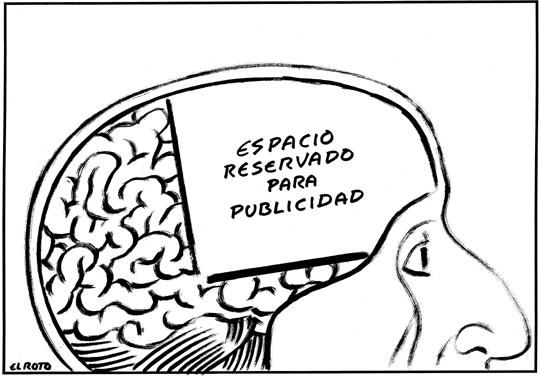

- ## ¿Qué es el Capitalismo de Vigilancia?
	- {{embed ((64832728-c228-4c7b-82a6-9566a42b5dab))}}
	- Entiende la experiencia humana como una materia prima gratuita para transformarla en datos de comportamiento y predicciones.
- ## GAFAM
	- {:height 392, :width 536}
- ## Publicidad
	- 
- ## Referencias
- [[@Capitalismo de vigilancia]]
- [[@LA ERA DEL CAPITALISMO DE LA VIGILANCIA | LA LUCHA POR UN FUTURO HUMANO FRENTE A LAS NUEVAS FRONTERAS DEL PODER]]
	- {{embed [[hls__La_era_del_capitalismo_de_la_vigilancia-Shoshana_Zuboff_1684413599927_0]]}}