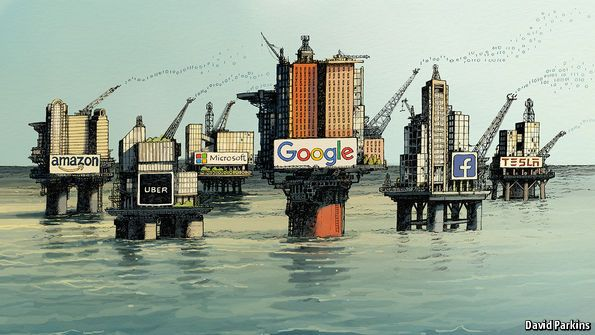
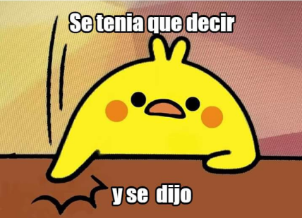
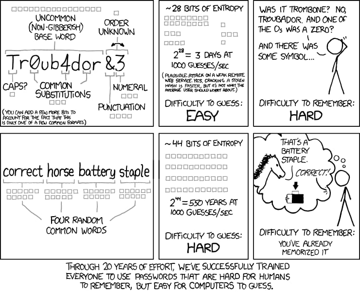

public:: true

- # Primeros pasos para la autodefensa digital
- # Índice
  id:: 648a6531-a1b9-43b5-b95e-7ee32f34e2ea
	- **Conceptios previos**
	  + Contexto
	  + Seguridad poco a poco
	  + Los malos a.k.a modelo de amenazas
	  + Seguridad operacional vs. Seguridad intrumental
	  + Primeros pasos
	- **Estructura**
	  + Problema 
	  + Preguntas 
	  + Soluciones 
	- **Seguridad básica**
	  + Contraseñas
	  + Software
	  + Dispositivos
	  + Bloqueo de móvil
	  + Cifrado de ordenador
	  + Conversaciones
	- **Anonimato**
	  + Recolección masiva
	  + Privacidad
	  + Redes
	  + Reconocimiento físico
	- **Seguridad Avanzada**
	  + Separación de perfiles
	  + No crear más información de la necesaria
# Conceptos previos
	- ## 0. Contexto
	  id:: 648d75aa-79bc-44aa-b728-5f7ecf53cb0b
	  + [[La tecnología es política]]
	  {:align center, :height 711, :width 443}
	- ## 0. Contexto
	  id:: 648d75aa-f04f-4423-b932-ee8543270a6d
	  + La información es poder 
	  {:height 427, :width 667,  :align center}
	- ## 0. Contexto
	  id:: 648d75aa-8594-49ec-8fe8-7fb7a040b95d
	  + No me importa la privacidad. 
	  + "[[No tengo nada que ocultar]]". 
	  {:align center, :height 316, :width 430}
	- ## 0. Contexto
	  id:: 648d75aa-fce6-4758-9689-701413d72f28
	  + ¿Tendrías problemas en instalar una webcam en tu baño o en tu dormitorio?
	  + ¿Conoces todas y cada una de las leyes tan bien como para poder decir que no haces nada ilegal?
	  + El haber tenido determinadas enfermedades, o simplemente algunos hábitos "no saludables" te pueden hacer inasegurable en paises como EE.UU.
	- ## 0. Contexto
	  id:: 648d7831-5bef-4fd2-a5a7-d5103f89c244
	  + "Nada que ocultar... mientras estés 100% de acuerdo con la visión y las políticas de tu gobierno". *Emily Kate Goulding*
	  + "Decir que no importa el derecho a la privacidad porque no tienes nada que ocultar es como justificar que no importa la libertad de expresión porque no tienes nada que decir". *Edward Snowden*
	  {:height 232, :width 367, :align center}
	- ## 0. Contexto
	  id:: 648d75aa-47c4-4efe-ace5-bfbca49ef05d
	  + [[Capitalismo de Vigilancia]]
	  {:height 190, :width 616, :align center}
	- ## 0. Contexto
	  id:: 648d75aa-f13a-40c9-81ed-6b6a6d8cdf23
	  + Modelos predictivos de publicidad y comportamiento futuro 
	  {:height 1009, :width 593, :align center}
	- ## 0. Contexto
	  id:: 648d75aa-9f73-4e43-86e2-5c5d0d8848a5
	  + [[Efecto panóptico]]
	      + Sentir que nuestros actos estén bajo inspección, se rechazan pensamientos o actos subversivos. Revolución en el comportamiento humano para que no se cuestionen ciertos paradigmas establecidos por convención social.
	  {:height 233, :width 369, :align center}
	- ## 0. Contexto
	  id:: 648d75aa-5de9-4d52-9ade-8a9707a5eaca
	  + [[Soberanía tecnológica]]
	  {:height 355, :width 468}
	- ## 1. Seguridad poco a poco:
	  id:: 648d75aa-c156-48f8-95b6-68eafa289090
	  * **No hay que asustarse ni agobiarse**.
	  * Los **cambios** se deben hacer **poco a poco** para no agotarse.
	  * [[Rutina de combate e interiorización de la seguridad]] 
	  {:height 353, :width 467, :align center}
	- ## 2. Los malos a.k.a modelo de amenaza
	  id:: 648d75aa-f6e7-4c7a-bac7-0f6b7c75addf
	  + ¿Qué quieres proteger?
	  + Identificación y evaluación de riesgos
	- ## 2. Los malos a.k.a modelo de amenaza
	  id:: 648d75aa-0db7-496a-9f0f-809e2a115c59
	  + ¿De quién quieres defenderte?
	  {:height 147, :width 141}
	- ## 3. Seguridad operacional vs. Seguridad intrumental
	  id:: 648d75aa-8c87-4e62-9a50-ef1381b60a21
	  +  ^^Seguridad operacional (OPSEC)^^: se centra en el uso de 
	  **procesos y protocolos para aumentar la seguridad**. 
	  + ^^Seguridad instrumental^^: se centra en el uso de
	  **herramientas y aplicaciones para aumentar la seguridad**.
	- ## 4. Primeros pasos
	  id:: 648d75aa-883b-4b16-be0f-c21e673a289b
	  + **Evaluación de riesgos** 
	  + Análisis de los procesos y vectores de ataque actuales
	  + Proteger el **punto más débil**
	  + Elabora una **rutina** para empezar poco a poco
	  + Inventario de la **mochila de datos**
	  + Aligerar peso
	  + **Separar perfiles**
# Seguridad básica
	- ## 1. **Contraseñas**:  
	  
	  La mayoría de la seguridad depende de las contraseñas, pero todavía existen contraseñas como:
	  ```
	  passwordf
	  pepe1997
	  urss1917
	  Tr0ub4dor&3
	  ```
	  ¿Por qué se consideran inseguras estas contraseñas?
	- ## 1. **Contraseñas**:  
	  
	- ## 1. **Contraseñas**:  
	  Además sigue habiendo filtraciones de datos, exponiendo hasta las contraseñas seguras.
	  {:height 348, :width 641, align center}
	- ## 1. **Contraseñas**: 
	  + ¿Cuándo una contraseña es segura?
	  + ¿Cómo gestionamos las contraseñas?
	  + ¿Qué tipo de [[autenticación]] es más segura?
	- ## 1. **Contraseñas**:   
	  ^^**Seguridad Operacional**^^
	  + **Larga** es mejor que compleja
	  + **Cambiarlas** de vez en cuando
	  + **Nunca reutilizarlas**
	  + Es mejor **no tener que recordarlas**
	  + **No poner todos los huevos en la misma cesta**
	  + **Usar [[autenticación]] multifactor**
	- ## 1. **Contraseñas**:  
	  ^^**Seguridad Instrumental**^^
	  + [**HaveIBeenPwned**](https://haveibeenpwned.com/): sitio web para saber si algún servicio que usamos ha sido hackeado
	  + **Gestores de contraseñas**:
	      + [**KeePassXC**](https://keepassxc.org/): en local, móvil y con extensión para el navegador
	      + **[BitWarden](https://bitwarden.com/)**: servicio online
	      + **[VaultWarden](https://vaultwarden.us/)**: servicio para autoalojar
	  + Combinar varias **palabras aleatorias** que nos sean fáciles de recordar
	  + Activar la **verificación en dos pasos** en todos los servicios que lo permitan
	- ## 2. **Software**: 
	  + Aparecen nuevas vulnerabilidades todos los meses
	  + Aparece nuevo malware frecuentemente
	  + Descargamos e instalamos aplicaciones sin saber qué hacen realmente y cuál es su fuente
	  + Tu móvil ya no tiene mantenimiento y deja de actualizarse
	- ## 2. **Software**: 
	  + ¿Cuándo se considera que el **software es seguro**?
	  + ¿Cuál es el riesgo de que una aplicación no sea segura? ¿Qué consecuencias puede tener?
	  + ¿El el código libre más seguro que el código privativo? ¿GNU/Linux es más seguro que Windows?
	  + ¿Cómo nos protogemos frente al **acceso remoto**?
	- ### 2.1. **Software**:  
	  ^^**Seguridad Operacional**^^
	  + **Actualizar frecuentemente**
	  + Instalar solo de **fuentes fiables**
	  + Confiar en las **comunidades activas**
	  + **Compartir** las preocupaciones y **pensar en colectivo**
	- ### 2.2 **Software**:  
	  ^^**Seguridad Operacional**^^
	  + Anti-Virus
	     + ClamAV como antivirus y UFW como firewall para GNU/Linux
	     + WindowsDefender es suficientemente bueno y viene por defecto en Windows
	- ## 3. **Dispositivos**: {:height 47, :width 33}
	  + Los teléfonos móviles, mediante sus antenas de telefonía anuncian su posición constantemente.
	  + WiFi y Bluetooth también pueden (menos común y permite menos rango)
	  + Eso se usa para rastrear e identificar a activistas
	  
	- ## 3. **Dispositivos**: 
	  	* ¿Cómo se puede rastrear un teléfono móvil?
	  	* ¿Para qué puede servir conocer las actividades históricas de las personas (participación en eventos o  relaciones personales)?
	- ### 3.1 **Dispositivos**: 
	  id:: 648d75aa-1160-4b80-8dd7-657a1e9ebec7
	  ^^**Seguridad Operacional**^^
	  + Poner el **modo avión o apagar** cuando no se esté usando
	  + Activar opción de **apagado automático de WiFi y Bluetooth** si no está conectado
	  + Tener en cuenta qué información ofreces en una protesta
	- ### 3.1 **Dispositivos**: 
	  ^^**Seguridad Instrumental**^^
	  + Modo avión
	  + Bolsa de Faraday
	- ## 4. **Bloqueo de móvil**: 
	  + Dejas la huella del patrón marcado en la pantalla.
	  + Pierdes el móvil por la calle.
	  + Te arrestan en una protesta. La policía tiene tu móvil.
	  + **¿Qué información podrían obtener?**
	- ## 4. **Bloqueo de móvil**: 
	  id:: 648d75aa-fec7-4aad-a7b5-d80e83495cb7
	  + Los **teléfonos móviles no fueron diseñados para la privacidad y seguridad** ¿Qué información guardamos en ellos?
	  + ¿Qué tiene **mayor valor**: el móvil o los datos que almacenas?
	  + ¿Puede mi adversario **observarme desbloquear el teléfono** antes de ganar acceso físico a él?
	  + ¿Puede mi adversario **obligarme o coaccionarme para desbloquear el dispositivo**?
	  + ¿Mi adversario puede **recoger muestras biométricas** (huellas, iris, fotografías) para desbloquear el dispositivo con ellas?
	  + ¿Mi adversario cuenta con conocimientos o medios especializados para el **desbloqueo por fuerza bruta** de mi dispositivo?
	- ## 4. **Bloqueo de móvil**:  
	  ^^**Seguridad Operacional**^^
	  + **Cifrar el móvil**
	  + Utilizar un **bloqueo seguro**
	  + **Separar perfiles**
	  + **Conoce al enemigo**
	- ## 4. **Bloqueo de móvil**: 
	  id:: 648d75aa-b139-4755-9494-577559bb2dad
	  ^^**Seguridad Instrumental**^^
	  + No **utilizar (o desactivar) el bloqueo biométrico** antes de una protesta
	  + **Cifrado** nativo de Android o Apple
	  + [Eliminar aplicaciones instaladas de fábrica](https://github.com/0x192/universal-android-debloater)
	  + Sistemas operativos enfocados en privacidad: [[LineageOS]], [[crDroid]], [[DivestOS]], ... 
	  + Hardenizar Android: [GrapheneOS](https://grapheneos.org/), [CalyxOS](https://calyxos.org/) o [CopperheadOS](https://copperhead.co/android/) están centrados en seguridad
	- ## 5. **Cifrado de ordenador**: 
	  + Si se tiene acceso físico al ordenador estás vendido. 
	  + Estás de cervezas y te roban la mochila con el ordenador.
	  + Si la policía te arresta tendrá acceso físico.
	- ## 5. **Cifrado de ordenador**: 
	  + ¿Qué **datos no tenemos cifrados**? ¿Pueden comprometernos a nosotros o a nuestro colectivo?
	  + ¿Qué tiene **mayor valor**: el ordenador o los datos que almacenas? ¿Copias de seguridad cifradas?
	- ## 5. **Cifrado de ordenador**: 
	  ^^**Seguridad Operacional**^^
	  + Mantener el **ordenador apagado** cuando no se usa
	  + **Contraseña segura y secreta**
	- ^^**Seguridad Instrumental**^^
	  + Linux: [LUKS](https://wiki.archlinux.org/index.php/Dm-crypt) y [más en la ArchWiki](https://wiki.archlinux.org/index.php/Disk_encryption)
	  + Windows: [BitLocker](https://docs.microsoft.com/en-us/windows/security/information-protection/bitlocker/bitlocker-overview)
	  + Apple: [FileVault](https://support.apple.com/en-us/HT204837)
	- ## 6. **Conversaciones**: 
	  id:: 648d88b9-f3fc-4779-b35d-1d5270089b49
	  + Para coordinar acciones en grupo es **necesario comunicarse**
	  + Siempre hay alguna persona que **habla más de la cuenta**
	  + A la policía le gusta saber lo que se dice en esos grupos
	- ## 6. **Conversaciones**: 
	  + ¿Qué **temas sensibles** se hablan a través de **grupos abiertos**?
	  + ¿Existe un **anillo de confianza** entre las personas del grupo?
	  + ¿Qué persona suele **hablar más de la cuenta** de los asustos del colectivo?
	- ## 6. **Conversaciones**:  :
	  ^^**Seguridad Operacional**^^
	  + Cuidado con **quién entra en el grupo**
	  + **Borra los mensajes sensibles** o usa chats con autodestrucción
	  + Usar **protocolos interoperables y abiertos** para comunicarnos
	  + El **punto más débil** no eres tú, puede ser otra persona
	  + La seguridad en los grupos es el resultado de la **suma de compromisos individuales** por no exponer la privacidad de los demás miembros
	- ## 6. **Conversaciones**:  :
	  ^^**Seguridad Instrumental**^^
	  + [Signal](https://www.signal.org/)
	  + Conversations (jabber/xmpp)
	  + Element (matrix)
	  + Jami
	  + Briar
	  + aTox
# **Privacidad y Anonimato**
	- ## 1. **Recolección masiva** 
	  + Nuevas formas de **recolección de datos == nuevas amenazas**. 
	  + Muchas veces, lo importante no es el contenido sino los **[[metadatos]]**.
	  + Los metadatos de una comunicación son **más informativos que el contenido** de la misma y a su **automatización es sencilla**. Los **metadatos revelan la identidad, costumbres y asociaciones de las personas**.
	- ## 2. **Privacidad** 
	  + Con el **control y recolección de información** por parte de anunciantes, Google, Facebook, data brokers y prácticamente cualquiera, nuestra actividad en internet funciona para crear perfiles que **nos conocen mejor que nosotras mismas**.
	  {:height 391, :width 379}
	- ## 2. **Privacidad**:  :
	  ^^**Seguridad Operacional**^^
	  + **Conoce el valor de tus datos**
	  + Uso de **nuevas identidades** con **correos temporales y teléfonos virtuales** temporales
	- ## 2. **Privacidad**:  :
	  ^^**Seguridad Instrumental**^^
	  + Navegadores: [Firefox](https://www.mozilla.org/en-US/firefox/new/), [Ungoogled Chromium](https://github.com/ungoogled-software/ungoogled-chromium), [Vanadium](https://github.com/GrapheneOS/Vanadium)
	  + Buscadores: [SearXNG](https://docs.searxng.org/), [DuckDuckGo](https://duckduckgo.com/), [StartPage](https://www.startpage.com/)
	  + Extensiones para bloquear publicidad y tracker: [uBlock Origin](https://addons.mozilla.org/en-US/firefox/addon/ublock-origin/), Privacy Badger y [Decentraleyes](https://addons.mozilla.org/en-US/firefox/addon/decentraleyes/?src=collection)
	  + Borrar cookies: [CookieAutoDelete](https://addons.mozilla.org/en-US/firefox/addon/cookie-autodelete/)
	  + Bloquear scripts para evitar rastreadores: [NoScript](https://noscript.net/)
	  + Separación de perfiles: [Multi-Account Containers](https://addons.mozilla.org/en-US/firefox/addon/multi-account-containers/)
	  + Utilizar siempre HTTPS, existe la opción nativa en los navegadores y sino con la extensión [HTTPSEverywhere](https://www.eff.org/https-everywhere)
	  + DNS-over-HTTPS (DoH)
	- ## 3. **Redes** 
	  + **Nada en la red es anónimo**, al menos hoy en día. Si realmente queremos que nadie sepa lo que hacemos hay que buscar otras formas de navegar internet.
	- ## 3. **Redes**:  
	  ^^**Seguridad Operacional**^^
	  + No digas nada, no lo relaciones contigo.
	  + Sigue el resto de consejos, especialmente el de separar perfiles.
	- ## 3. **Redes**:  
	  ^^**Seguridad Instrumental**^^
	  + VPNs: WireGuard, RiseupVPN, TunnerBear
	  + [Tor](https://www.torproject.org/) ([Tails](https://tails.boum.org/), [Whonix](https://www.whonix.org/))
	  + [I2P](https://geti2p.net/en/)
	- ## 4. **Reconocimiento físico** 
	  Todas las manifestaciones son grabadas. Las caras y los tatuajes son muy útiles para reconocerte, tápalos.
	  {:height 203, :width 344, :align center}
	- ## 4. **Reconocimiento físico**:  
	  ^^**Seguridad Operacional**^^
	  + Tapa todo aquello que te pueda identificar físicamente
# **Seguridad avanzada**
	- ## 1. **Separación de perfiles**  
	  + Crear distintos perfiles: personal, activista, profesional... con distintos grados de vinculación a ti y totalmente separados entre ellos.
	  + Separarlos desde el principio.
	  + También puede ser útil tener perfiles de usar y tirar.
	- ## 2. **No crear más información de la necesaria**  
	  + Toda información que no generas no puede ser utilizada contra ti
	  + No existe una información mejor protegida que aquélla que no se llega a generar, ya que no existe forma alguna, humana o técnica, de comprometerla
	- ## 3. **Pensamiento ofensivo**  
	  + El atacante utilizará el método que le sea más fácil. Intentar atacarte te ayuda a encontrar los puntos débiles.
	  
	- ## 4. **OSINT**
	  + [Inteligencia de fuentes abiertas, entrada de Wikipedia](https://es.wikipedia.org/wiki/Inteligencia_de_fuentes_abiertas)
	  + [OSINT framework](https://osintframework.com/)
	  + [OSINT tools collection](https://github.com/cipher387/osint_stuff_tool_collection)
	- ## 5. **Ingeniería social**
	  + Infiltrar, engañar, nada les parece demasiado. Pero nunca parecen así. No hay que caer en la paranoia ni confiarnos demasiado.
	  + Más fácil manipular a las personas que a las máquinas.
	  + Más del 99% de los ataques requieren la intervención humana para conseguir sus objetivos.
	  + Sesgos cognitivos
- # **Conclusiones**
  +  Rutinas donde ir introduciendo nuevos elementos poco a poco
  + Más info en: [https://reminiscencia.frama.io](https://reminiscencia.frama.io)
- # **Referencias**
  + [[@RESISTENCIA DIGITAL | MANUAL DE SEGURIDAD OPERACIONAL E INSTRUMENTAL PARA SMARTPHONES]] 
  + [[Software Libre en móviles]] 
  + [Guía de Defensa Digital para Organizaciones Sociales](https://lalibre.net/wp-content/uploads/2022/09/Guia-de-proteccion-digital.pdf)
  + [Manual de autodefensa en la era de la digitalización forzada o Resistencia al capitalismo de vigilancia](https://codeberg.org/PrivacyFirst/Data_Protection/issues)/
- # **Recopilaciones o colecciones de herramientas**
  id:: f4c8bca4-6d5c-4e19-a733-3aa23777b201
  + Privacy Guides:
  	+ [Privacy Guides - Android Overview](https://www.privacyguides.org/os/android-overview/)
  	+ [Privacy Guides - Android](https://www.privacyguides.org/android/)
  	+ [Privacy Guides  - Privacy Tools](https://www.privacyguides.org/tools/)
  + Prism break:
  	+ [Android](https://prism-break.org/es/categories/android/)
  	+ [iOS](https://prism-break.org/es/categories/ios/)
  + EFF:
  	+ [Surveillance Self-Defense](https://ssd.eff.org/es)
  	    + [Android](https://ssd.eff.org/es/search?q=android&commit=Buscar)  
  	    + [iOS](https://ssd.eff.org/es/search?q=ios&commit=Buscar)  
  + [The Guardian Project](https://guardianproject.info/)
  + [Desgooglicemos Internet](https://degooglisons-internet.org/es/)
  + [switching.software](https://switching.software/)
  + [Privacy Tools - Android alternatives](https://www.privacytools.io/android-alternatives)
  + Gofoss:
  	+ [Degoogled Phones - Free Your Phone From Google And Apple](https://gofoss.net/intro-free-your-phone/)
  	+ [Top 75 Tracker Free FOSS Apps (FDroid & Aurora Store)](https://gofoss.net/foss-apps/)
- # Preguntas y debate