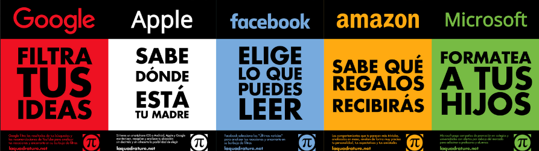

- # Introducción a la autodefensa digital
- # Índice
  id:: 648a6531-a1b9-43b5-b95e-7ee32f34e2ea
	- **Conceptios previos**
	  + Contexto
	  + Seguridad poco a poco
	  + Los malos a.k.a modelo de amenazas
	  + Seguridad operacional vs. Seguridad intrumental
	  + Primeros pasos
	- **Estructura**
	  + Problema 
	  + Preguntas 
	  + Soluciones 
	- **Seguridad básica**
	  + Contraseñas
	  + Software
	  + Dispositivos
	  + Bloqueo de móvil
	  + Cifrado de ordenador
	  + Conversaciones
	- **Anonimato**
	  + Recolección masiva
	  + Privacidad
	  + Redes
	  + Reconocimiento físico
	- **Seguridad Avanzada**
	  + Separación de perfiles
	  + No crear más información de la necesaria
# Conceptos previos
	- ## 0. Contexto
	  + La tecnología es política
	  + La información es poder «El conocimiento es poder»
	  + > No me importa la privacidad porque no tengo nada que ocultar .         Es como decir : No me importa la libertad de expresion porque no tengo nada que decir .
	  + [[Capitalismo de Vigilancia]]
	  + [[Efecto panóptico]]
	  + [[Soberanía tecnológica]]
	  {:height 190, :width 616, :align center}
	- ## 1. Seguridad poco a poco:
	  {:height 353, :width 467, :align center}
	- ## 2. Los malos a.k.a modelo de amenaza
	  {:height 597, :width 389} {:height 147, :width 141}
	- ## 3. Seguridad operacional vs. Seguridad intrumental
	  +  ^^Seguridad operacional (OPSEC)^^: se centra en el uso de 
	  **procesos y protocolos para aumentar la seguridad**. 
	  + ^^Seguridad instrumental^^: se centra en el uso de
	  **herramientas y aplicaciones para aumentar la seguridad**.
	- ### 4. Primeros pasos
	  {:height 144, :width 167} {:height 355, :width 468}
# Seguridad básica
	- ## 1. **Contraseñas**:  {:height 47, :width 33}
	  
	  La mayoría de la seguridad depende de las contraseñas, pero todavía existen contraseñas como:
	  ```
	  123456789
	  passwordf
	  pepe1997
	  a&n2#yn8
	  ```
	  
	  Además sigue habiendo filtraciones de contraseñas, exponiendo hasta las contraseñas seguras.
	- ## 1. **Contraseñas**:  {:height 40, :width 40}
	  
	  + ¿Cuándo una contraseña es segura?
	  + ¿Cómo gestionamos las contraseñas?
	  + ¿Cuál es la [[autenticación]] más segura?
	- ### 1.1. **Contraseñas**: {:height 40, :width 40} 
	  ^^**Seguridad Operacional**^^
	  + **Larga** es mejor que compleja
	  + **Cambiarlas** de vez en cuando
	  + **Nunca reutilizarlas**
	  + **Usar [[autenticación]] multifactor**
	  + **No poner todos los huevos en la misma cesta**
	- ### 1.2. **Contraseñas**: {:height 40, :width 40}
	  ^^**Seguridad Instrumental**^^
	  + [**HaveIBeenPwned**](https://haveibeenpwned.com/): sitio web para saber si algún servicio que usamos ha sido hackeado
	  + **Gestores de contraseñas**:
	      + [**KeePassXC**](https://keepassxc.org/): en local, móvil y con extensión de navegador
	- ## 2. **Software**: {:height 47, :width 33}
	  + Aparecen vulnerabilidades nuevas todos los meses
	  + Aparece nuevo malware frecuentemente
	- ## 2. **Software**: {:height 40, :width 40}
	  + ¿Cuando se considera que un software es seguro?
	- ### 2.1. **Software**: {:height 40, :width 40}
	  ^^**Seguridad Operacional**^^
	  + Actualizar frecuentemente
	  + Instalar solo de fuentes fiables
	- ### 2.2 **Software**: {:height 40, :width 40}
	  ^^**Seguridad Operacional**^^
	- ## 3. **Dispositivos**: {:height 47, :width 33}
	- ### 3.1 **Dispositivos**: {:height 40, :width 40}
	  ^^**Seguridad Operacional**^^
